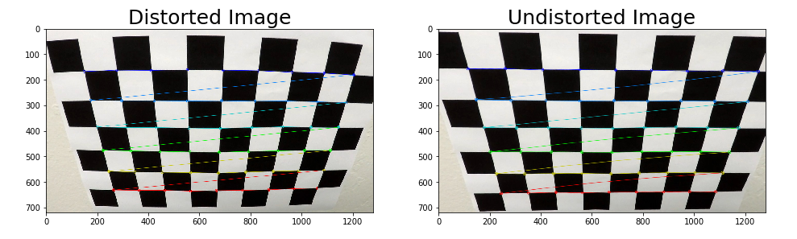
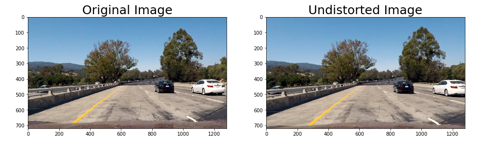
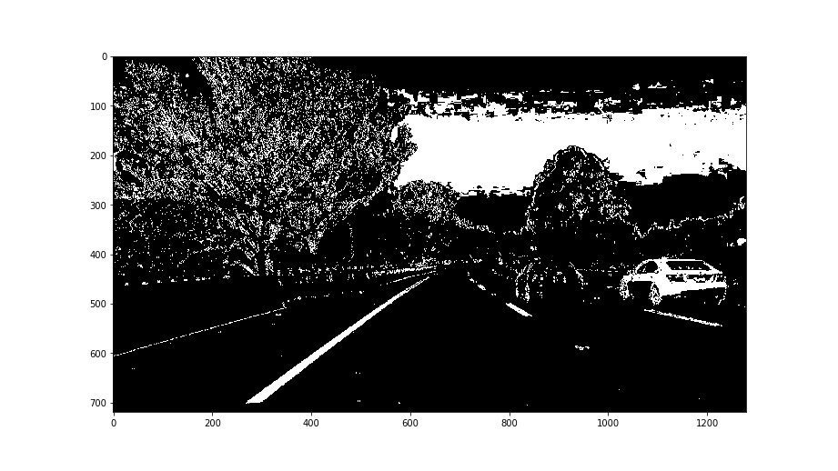
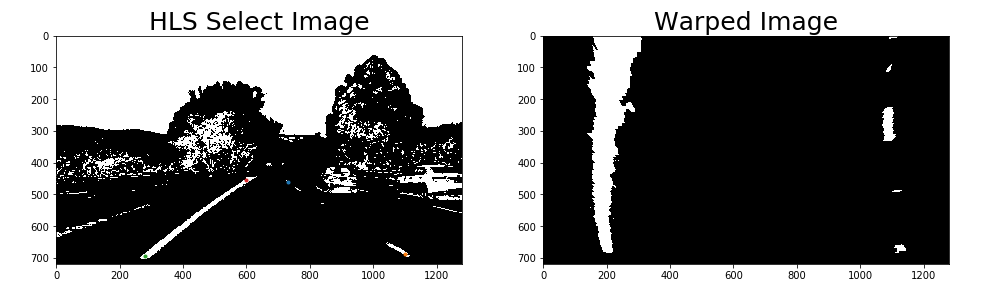
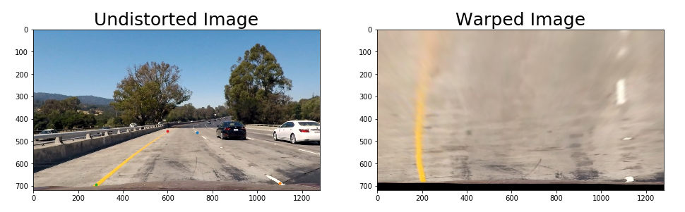
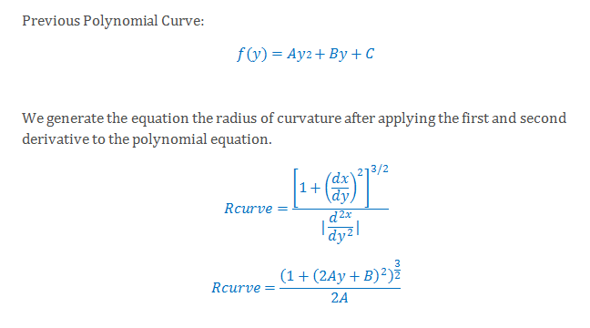
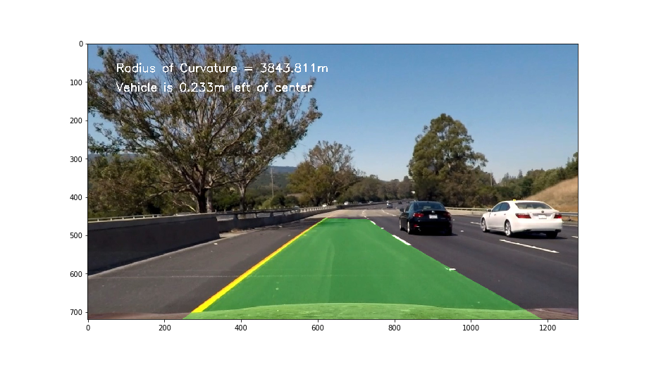

**Advanced Lane Finding Project**

The goals / steps of this project are the following:

* Compute the camera calibration matrix and distortion coefficients given a set of chessboard images.
* Apply a distortion correction to raw images.
* Use color transforms, gradients, etc., to create a thresholded binary image.
* Apply a perspective transform to rectify binary image ("birds-eye view").
* Detect lane pixels and fit to find the lane boundary.
* Determine the curvature of the lane and vehicle position with respect to center.
* Warp the detected lane boundaries back onto the original image.
* Output visual display of the lane boundaries and numerical estimation of lane curvature and vehicle position.

---

**Camera Calibration**

**1. Briefly state how you computed the camera matrix and distortion coefficients. Provide an example of a distortion corrected calibration image.**

By using the function `cv2.drawChessboardCorners` we can locate the coordinates of the corners inside a distorted chessboard image.  Having the object points and image points we can compute the camera calibration and distortion coefficients using the `cv2.calibrateCamera()` function. Once calibration is complete, OpenCV's `cv2.undistort` function is very effective in undistorting the image. The same steps can be applied to a road image as well.

---

**Pipeline (single images)**

**1. Provide an example of a distortion-corrected image.**

**2. Describe how (and identify where in your code) you used color transforms, gradients or other methods to create a thresholded binary image.  Provide an example of a binary image result.**

(process_image.py line 2-11) Utilizing gradient thresholds, HLS and HLV thresholding, I combine these thresholds to generate a binary image. Through various testing, absolute sobel threshold combined with Saturation and Value channels is able to clearly illustrate the lane lines in white or yellow and with other unnecessary pixels filtered out such as shadows, change in color pavement. From my observation, gradient magnitude and gradient direction thresholds don't react well to shadows. All the transformation functions are defined in the jupyter notebook.

**3. Describe how (and identify where in your code) you performed a perspective transform and provide an example of a transformed image.**

In the 6th cell of my jupyter notebook file, I've pinpointed the source coordinates of a test image where the lane lines appeared to be parallel and the area where I wanted my perspective transform to take place.  Once this process was complete, I utilize a warp function I defined in the previous cell and map out the destination coordinates and apply a prespective transform using OpenCV's `cv2.warpPerspective`.

This resulted in the following source and destination points:

| Source      | Destination | Position    |
|-------------|-------------| ------------|
| 730, 460    | 1120, 0     | Top Right   |
| 1100, 690   | 1120, 680   | Bottom Right|
| 280, 695    | 200, 680    | Bottom Left |
| 600, 455    | 200, 0      | Top Left    |

**4. Describe how (and identify where in your code) you identified lane-line pixels and fit their positions with a polynomial?**

(process_image.py line 17-95) I use a sliding window search on the histogram along all the columns of a perspective transformed image to identify the lane lanes illustrated by pixel density.  The starting point of the lane lines will be at the peak in the histogram for each respective line.  We start at the bottom of the image and append line positions to an array for each line where the density is at its peak. We repeat this process as we move up the image until a good fit of the both lines are generated.  Utilizing this information we can fit a polynomial to map the road and do a targeted search for the next image based on the pixel positions gathered earlier to fit a second order polynomial curve.

**5. Describe how (and identify where in your code) you calculated the radius of curvature of the lane and the position of the vehicle with respect to center.**

(process_image.py line 97) To calculate the radius of curvature, we utilize the information gathered from the polynomial curve from before, average out the left and right curvature radii and calculate the second order of polynomial and apply them to the x,y in world space.  By utilizing these equations we are able to calculate the radius of the curvature:

(process_image.py line 102) Assuming that the camera is mounted in the middle of the car, we can compare the center points of the binary warped space of the image's center and measure the differences in position with respect to the center.  

**6. Provide an example image of your result plotted back down onto the road such that the lane area is identified clearly.**

---

**Pipeline (video)**

**1. Provide a link to your final video output.  Your pipeline should perform reasonably well on the entire project video (wobbly lines are ok but no catastrophic failures that would cause the car to drive off the road!).**

https://github.com/atlas604/advanced-lane-lines/blob/master/video_output.mp4

---

**Discussion**

**1. Briefly discuss any problems / issues you faced in your implementation of this project.  Where will your pipeline likely fail?  What could you do to make it more robust?**

Since my pipeline takes the input frame by frame, some lanes at certain frames may not be detected by the algorithm.  Having an empty array will result in errors.  To accommodate this issue, we can either lower the threshold to help detect less visible lanes or take in the data from the previous frame whenever an empty lane is detected.  I recognize the lane boundaries may slightly overflow to the other lane; however, as long as the car is maintaining its position relatively close to the center, this shouldn't impose a problem.  

The contrast of the image affects the pipeline a lot as well.  Having a lot of shadows or running the pipeline at night with bad lighting can ruin the visibility of the lanes and cause errors.  To fix these issues, we can implement an algorithm that adjusts the contrast when the detected image is too dark or normalizes the data in a certain way. Additionally, we can improve the model by storing data of the frames and average out the lane coordinates with a certain amount of frames then plots the curvature which should create smoother lines and fix distortion caused by shadows or changes in the landscape.  
